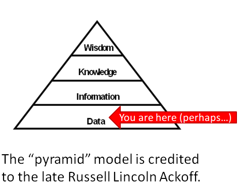
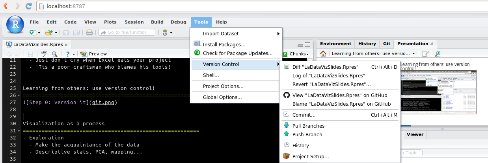
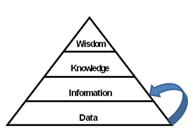

Visualizing Structural Change
========================================================
author: Tim Triche, Jr. 
date: May 8th, 2014


Learning from data: foundations
========================================================



Learning from data: a toolkit
========================================================
- Today I am going to use Rstudio, shiny, and d3.js
  - Rstudio makes it easy to do sensible things
  - shiny makes it easy to play with your data
  - d3.js makes it easy for others to interact
  
- You can use whatever you prefer
  - Use Python, Julia, or Excel for all it matters
  - Just don't cry when Excel eats your project
  - 'Tis a poor craftsman who blames his tools!


Learning from others: version control
========================================================

- Always, always, always use version control.
- Murphy's law is strictly enforced!


Visualization as a process
========================================================
- Exploration 
  - Make the acquaintance of the data
  - Descriptive stats, PCA, mapping...
  
- Modeling
  - Build models, make predictions
  - Evaluate model fit, predictions
  
- Iteration
  - Identify missing pieces
  - Lather, rinse, repeat


What's in this data?
========================================================  

- Descriptive statistics (tables, plots)
- Exploratory analysis (PCA, correlograms)


Descriptive tables
========================================================

```r
summary(cars)
```

```
     speed           dist    
 Min.   : 4.0   Min.   :  2  
 1st Qu.:12.0   1st Qu.: 26  
 Median :15.0   Median : 36  
 Mean   :15.4   Mean   : 43  
 3rd Qu.:19.0   3rd Qu.: 56  
 Max.   :25.0   Max.   :120  
```
- Problem: most people are visual


Let's plot the same thing
========================================================

```r
library(ggplot2)
ggplot(data=cars, aes(x=speed, y=dist)) + 
  geom_smooth() + 
  geom_point() + 
  theme_bw() + 
  xlab('Speed when brakes applied') +
  ylab('Distance to stop car') + 
  ggtitle('Speed vs. stopping distance for various cars')
```


Plots >> tables
========================================================
 


Exploratory interaction
========================================================
(in-browser shiny version of the same)


Exploratory interaction part II
========================================================
(in-browser PCA/tour of more complex data)


Modeling
========================================================


Model fit diagnostics
========================================================


Prediction diagnostics
========================================================


Refinement
========================================================


Simpson's paradox
========================================================


Anscombe's Quartet
========================================================


Model selection
========================================================


Lasso CV and path plots
========================================================


Time series
========================================================


Smoothing
========================================================


Model averaging
========================================================


Model likelihood over time
========================================================


Logistic model averaging
========================================================


Time-dependent covariates
========================================================


More diagnostics
========================================================


Apophenia
========================================================


Final steps
========================================================


Suggestions
========================================================


Acknowledgements
========================================================
